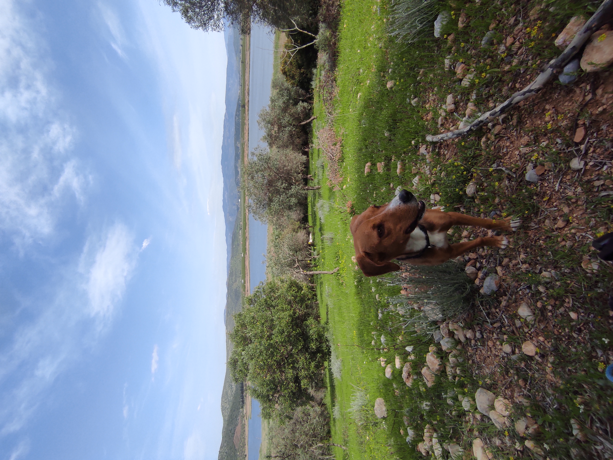
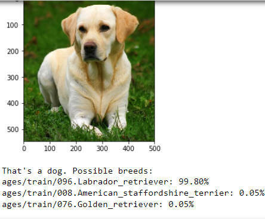
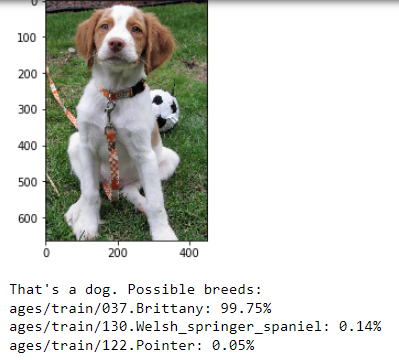

             


## About Project

Dogs have been our loyal companions for thousands of years, providing love, companionship, and protection. They come in various shapes, sizes, and temperaments, each breed with its own unique characteristics. There always been growing interest in understanding the various dog breeds, as this knowledge helps in identifying breed-specific health issues and guides us in building strong connections with these lovable creatures.

In this project, we have developed a dog breed classifier using Convolutional Neural Networks (CNN) that can accurately identify a dog's breed from its image. This classifier can be useful for potential pet owners looking to learn more about the breed of a dog they wish to adopt or for those who simply want to understand the breed-specific characteristics of their furry friends.


## Project Overview

In this project, a dog breed classifier is developed using Convolutional Neural Networks (CNN). Given an image of a dog, the classifier is able to predict the breed of the dog with high accuracy. The model can also distinguish between human and dog images, and if a human image is provided, it will suggest the most resembling dog breed.

         
        


## Project Instructions

### Instructions

1. Clone this repository and navigate to the downloaded folder.
```
git clone https://github.com/EmreToktay/Dog-Breed-Classifier
cd dog-project
```

2. Download the [dog dataset](https://s3-us-west-1.amazonaws.com/udacity-aind/dog-project/dogImages.zip).  Unzip the folder and place it in the repo, at location `path/to/dog-project/dogImages`.

3. Download the [human dataset](https://s3-us-west-1.amazonaws.com/udacity-aind/dog-project/lfw.zip).  Unzip the folder and place it in the repo, at location `path/to/dog-project/lfw`.  If you are using a Windows machine, you are encouraged to use [7zip](http://www.7-zip.org/) to extract the folder.

4. Donwload the [VGG-16 bottleneck features](https://s3-us-west-1.amazonaws.com/udacity-aind/dog-project/DogVGG16Data.npz) for the dog dataset.  Place it in the repo, at location `path/to/dog-project/bottleneck_features`.

5. (Optional) __If you plan to install TensorFlow with GPU support on your local machine__, follow [the guide](https://www.tensorflow.org/install/) to install the necessary NVIDIA software on your system.  If you are using an EC2 GPU instance, you can skip this step.

6. (Optional) **If you are running the project on your local machine (and not using AWS)**, create (and activate) a new environment.

	- __Linux__ (to install with __GPU support__, change `requirements/dog-linux.yml` to `requirements/dog-linux-gpu.yml`):
	```
	conda env create -f requirements/dog-linux.yml
	source activate dog-project
	```  
	- __Mac__ (to install with __GPU support__, change `requirements/dog-mac.yml` to `requirements/dog-mac-gpu.yml`):
	```
	conda env create -f requirements/dog-mac.yml
	source activate dog-project
	```  
	**NOTE:** Some Mac users may need to install a different version of OpenCV
	```
	conda install --channel https://conda.anaconda.org/menpo opencv3
	```
	- __Windows__ (to install with __GPU support__, change `requirements/dog-windows.yml` to `requirements/dog-windows-gpu.yml`):  
	```
	conda env create -f requirements/dog-windows.yml
	activate dog-project
	```

7. (Optional) **If you are running the project on your local machine (and not using AWS)** and Step 6 throws errors, try this __alternative__ step to create your environment.

	- __Linux__ or __Mac__ (to install with __GPU support__, change `requirements/requirements.txt` to `requirements/requirements-gpu.txt`):
	```
	conda create --name dog-project python=3.5
	source activate dog-project
	pip install -r requirements/requirements.txt
	```
	**NOTE:** Some Mac users may need to install a different version of OpenCV
	```
	conda install --channel https://conda.anaconda.org/menpo opencv3
	```
	- __Windows__ (to install with __GPU support__, change `requirements/requirements.txt` to `requirements/requirements-gpu.txt`):  
	```
	conda create --name dog-project python=3.5
	activate dog-project
	pip install -r requirements/requirements.txt
	```

8. (Optional) **If you are using AWS**, install Tensorflow.
```
sudo python3 -m pip install -r requirements/requirements-gpu.txt
```

9. Switch [Keras backend](https://keras.io/backend/) to TensorFlow.
	- __Linux__ or __Mac__:
		```
		KERAS_BACKEND=tensorflow python -c "from keras import backend"
		```
	- __Windows__:
		```
		set KERAS_BACKEND=tensorflow
		python -c "from keras import backend"
		```

10. (Optional) **If you are running the project on your local machine (and not using AWS)**, create an [IPython kernel](http://ipython.readthedocs.io/en/stable/install/kernel_install.html) for the `dog-project` environment.
```
python -m ipykernel install --user --name dog-project --display-name "dog-project"
```

11. Open the notebook.
```
jupyter notebook dog_app.ipynb
```

12. (Optional) **If you are running the project on your local machine (and not using AWS)**, before running code, change the kernel to match the dog-project environment by using the drop-down menu (**Kernel > Change kernel > dog-project**). Then, follow the instructions in the notebook.

__NOTE:__ While some code has already been implemented to get you started, you will need to implement additional functionality to successfully answer all of the questions included in the notebook. __Unless requested, do not modify code that has already been included.__

## Evaluation

The performance of the model is evaluated using test set accuracy. The higher the test set accuracy, the better the model is at classifying the dog breeds. The final model achieves a test accuracy of 81.22%.

## Archival Note

This project was developed based on the state-of-the-art CNN architectures and techniques available up to September 2021.

## CNN Structures (Building a model on my own)

Below is an example of one of the CNN structures used in this project:

```
model = Sequential()

# Conv layer1
model.add(Conv2D(32, 3, strides=(1,1), padding='same', activation='relu', input_shape=(224,224,3)))
model.add(MaxPooling2D((2,2), strides= 2, padding='same'))

# Conv layer2
model.add(Conv2D(64, 3, strides=(1,1), padding='same', activation='relu'))
model.add(MaxPooling2D((2,2), strides= 2, padding='same'))

# Conv layer3
model.add(Conv2D(128, 3, strides=(1,1), padding='same', activation='relu'))
model.add(MaxPooling2D((2,2), strides= 2, padding='same'))

# Conv layer4
model.add(Conv2D(256, 3, strides=(1,1), padding='same', activation='relu'))
model.add(MaxPooling2D((2,2), strides= 2, padding='same'))

# Conv layer5
model.add(Conv2D(256, 3, strides=(1,1), padding='same', activation='relu'))
model.add(MaxPooling2D((2,2), strides= 2, padding='same'))

#Flatten Layer
model.add(GlobalAveragePooling2D())
model.add(BatchNormalization())

#Fully Connected Layer
model.add(Dense(133, activation='softmax'))

```
This is just one of the CNN architectures used in the project. The final model utilizes a pre-trained ResNet-50 network with additional layers for the specific dog breed classification task.
